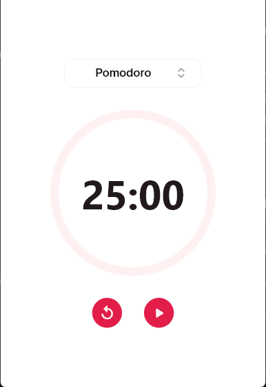
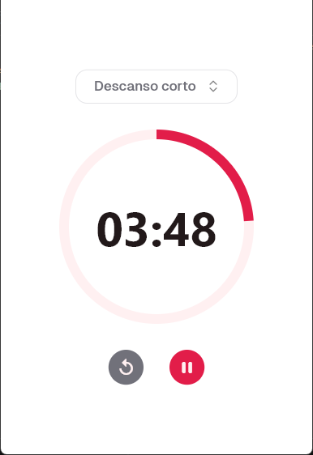

<p align="center">
  
</p>

<h1 align="center">Pomodoro</h1>

Una aplicación de temporizador Pomodoro desarrollada en **Flutter**, diseñada para ayudarte a mantenerte enfocado y administrar tu tiempo de manera efectiva.

---

## ✨ Características

- Soporte para múltiples sesiones (Pomodoro, Descanso corto, Descanso largo)
- Notificación sonora suave al finalizar una sesión
- Diseño minimalista y centrado
- Compatible con **Windows**
- Estado manejado con **BLoC**
- Internacionalización del formato de tiempo con `intl`

---

## 🖥️ Capturas de pantalla

### ⏱️ Temporizador Pomodoro

<p align="center">
  
</p>

### ⏱️ Modos Pomodoro

<p align="center">
  
</p>

### ⏱️ Temporizador Pomodoro corriendo

<p align="center">
  
</p>

---

## 🔧 Instalación

### 🪟 Opción 1: Instalador para Windows (recomendado)

1. Descarga el instalador desde la sección [Releases](https://github.com/EdwingVeraDuran/pomodoro/releases).
2. Ejecuta el archivo `PomodoroInstaller.exe`.
3. Sigue las instrucciones para instalar la app.

### 📦 Opción 2: Carpeta comprimida (.zip)

1. Descarga el archivo `.zip` desde [Releases](https://github.com/EdwingVeraDuran/pomodoro/releases).
2. Extrae el contenido en cualquier carpeta de tu equipo.
3. Ejecuta el archivo `pomodoro.exe` para iniciar la aplicación.

> ✅ No requiere instalación. Ideal si no quieres modificar tu sistema.

---

## ⚙️ Uso

- Inicia la aplicación.
- Selecciona la duración deseada (Pomodoro, Descanso corto, Descanso largo).
- Haz clic en **Iniciar**.
- Escucha una notificación suave cuando finalice la sesión.
- Mantente productivo 🧠💪

---

## 🧱 Tecnologías

- [Flutter](https://flutter.dev/)
- [Bloc](https://bloclibrary.dev/#/)
- [Intl](https://pub.dev/packages/intl)
- [audioplayers](https://pub.dev/packages/audioplayers)
- [shadcn_flutter](https://pub.dev/packages/shadcn_flutter)

---

## 📦 Compilación manual

Si quieres compilar tú mismo el proyecto:

```bash
flutter pub get
flutter build windows
